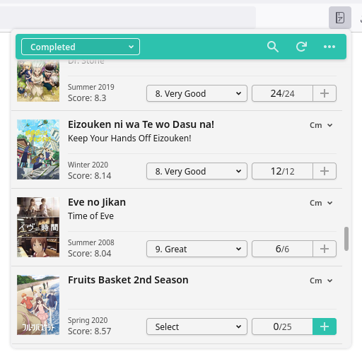
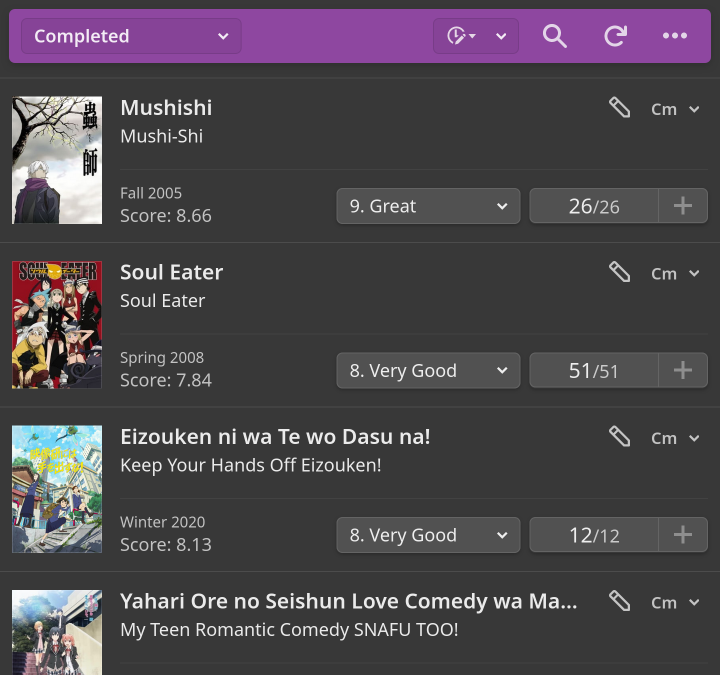

#  Anime List Popup

[](https://addons.mozilla.org/en-US/firefox/addon/anime-list-popup/) [](https://chrome.google.com/webstore/detail/anime-list-popup/glabhkacodgkcgnbccfkjhlkolcidkdo)

This is an extension for [Firefox](https://addons.mozilla.org/en-US/firefox/addon/anime-list-popup/), [Chrome, or Chromium-based browser](https://chrome.google.com/webstore/detail/anime-list-popup/glabhkacodgkcgnbccfkjhlkolcidkdo) that shows your anime list from MyAnimeList in the browser's toolbar.

You can change anime status, rating, and the number of watched episodes. There are also convenient shortcuts for opening anime and manga lists on the MyAnimeList website.

You will be asked to allow this extension access to your account when you first click on the button in the browser's toolbar. The access keys are stored locally, never transmitted anywhere but MyAnimeList API servers.

## Screenshots

| Light theme                           | Dark theme                          |
| ------------------------------------- | ----------------------------------- |
|  |  |

The theme is determined based on your browser's preferences.

## Building

To build the extension run the following:

```bash
cd /path/to/source/dir
npm install
npm run-script build
```

Extension files will be generated in the `dist` directory.
